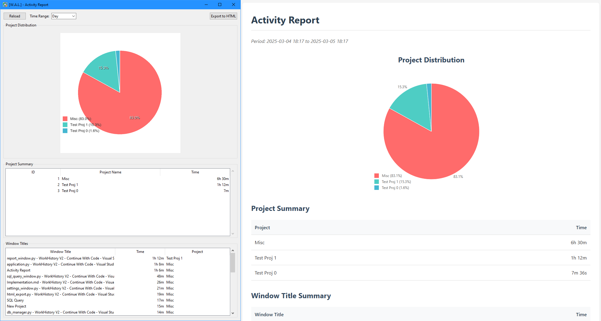
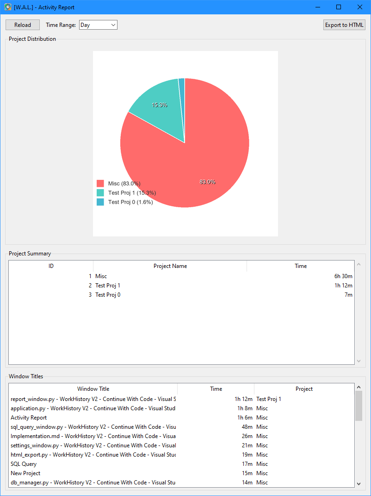
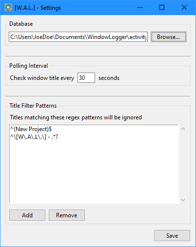
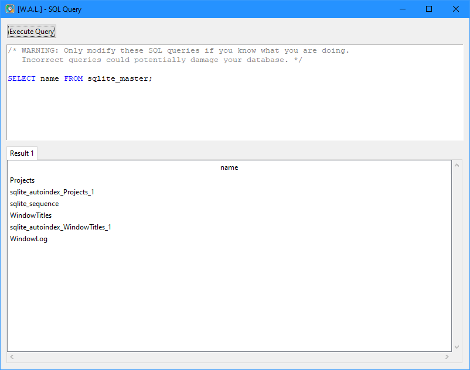

# Window Activity Logger

A Python-based background service that monitors and logs active window titles on Windows systems to help track time spent on different applications and projects.



## Features
- **Background Monitoring**: Tracks active window titles with configurable polling interval
- **Project Organization**: Group window titles into projects for better time tracking
- **Rich Reporting**: Visual charts and detailed time summaries
- **Interactive Interface**: System tray integration with easy access to all features
- **Flexible Configuration**: Customizable settings and regex-based title filtering
- **SQL Access**: Direct database access with syntax highlighting
- **Export Capability**: Generate self-contained HTML reports

## Screenshots

### Report Window

View activity summaries with interactive pie charts and project management.

### Settings

Configure database location, polling interval, and title filters.

### SQL Query Interface

Direct database access with syntax highlighting and result tabs.

## Requirements
- Windows Operating System
- Python 3.10 or higher
- Required Python packages (install via pip):
  ```
  pip install -r requirements.txt
  ```

## Quick Start

1. **Installation**
   ```bash
   # Clone the repository
   git clone [repository-url]
   cd window-activity-logger

   # Install dependencies
   pip install -r requirements.txt
   ```

2. **Running**
   ```bash
   python src/main.py
   ```
   The application will start in the system tray.

3. **Initial Setup**
   - Right-click the tray icon and select "Settings"
   - Configure the database path (defaults to Documents folder)
   - Adjust polling interval if desired
   - Add any title patterns to ignore

4. **Usage**
   - Right-click the tray icon for options:
     - Show Report: View activity statistics
     - Settings: Configure application
     - SQL Query: Direct database access
     - Exit: Close application

## Configuration

The application stores its configuration in:
```
%USERPROFILE%\Documents\WindowLogger\config.json
```

Settings include:
- Database file path
- Title polling interval (seconds)
- Regex patterns for filtering titles

## Data Storage

Activity data is stored in an SQLite database at:
```
%USERPROFILE%\Documents\WindowLogger\activity.db
```

The database includes:
- Window title history
- Project assignments
- Timing information

## Project Structure
```
├── doc/                    # Documentation
│   ├── Components.md      # Component details
│   ├── Concept.md         # Project overview
│   └── Implementation.md  # Implementation notes
├── gfx/                   # Screenshots
├── src/                   # Source code
│   ├── application.py     # Main application
│   ├── config_manager.py  # Configuration
│   ├── db_manager.py      # Database handling
│   ├── html_export.py     # Report generation
│   ├── main.py           # Entry point
│   ├── report_window.py  # Activity reports
│   ├── settings_window.py # Configuration UI
│   ├── sql_query_window.py # SQL interface
│   ├── system_tray.py    # System tray
│   └── window_monitor.py # Title monitoring
└── requirements.txt       # Dependencies
```

## Contributing

Contributions are welcome! Please read the documentation in the `doc` folder to understand the project structure and components.

## License

This project is licensed under the GNU General Public License v3.0 - see the [LICENSE](LICENSE) file for details. This means you can freely use, modify, and distribute this software, but any derivative works must also be distributed under the same license terms.
